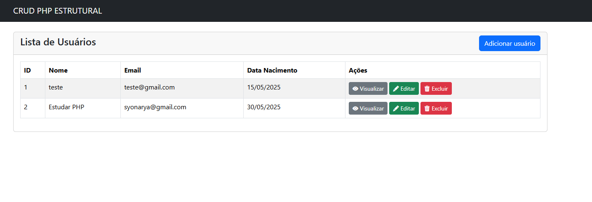

Projeto CRUD em PHP
Este é um projeto completo de CRUD (Criar, Ler, Atualizar e Deletar) desenvolvido por mim com PHP e MySQL, utilizando HTML/CSS e Bootstrap 5 para o front-end. O objetivo do projeto é praticar e demonstrar o funcionamento básico de um sistema de cadastro de usuários com interface simples, responsiva e funcional.

✅ Funcionalidades
Criar novos registros de usuários
Listar todos os usuários cadastrados em uma tabela
Editar informações dos usuários
Excluir usuários do banco de dados
Interface responsiva com Bootstrap 5
Conexão segura com o banco de dados usando PDO

🛠 Tecnologias Utilizadas
PHP – Lógica do back-end
MySQL – Banco de dados relacional
HTML5 / CSS3 – Marcação e estilo
Bootstrap 5 – Layout moderno e responsivo
PDO (PHP Data Objects) – Conexão segura com o banco

<h2>🖼️ Imagem do Projeto</h2>

